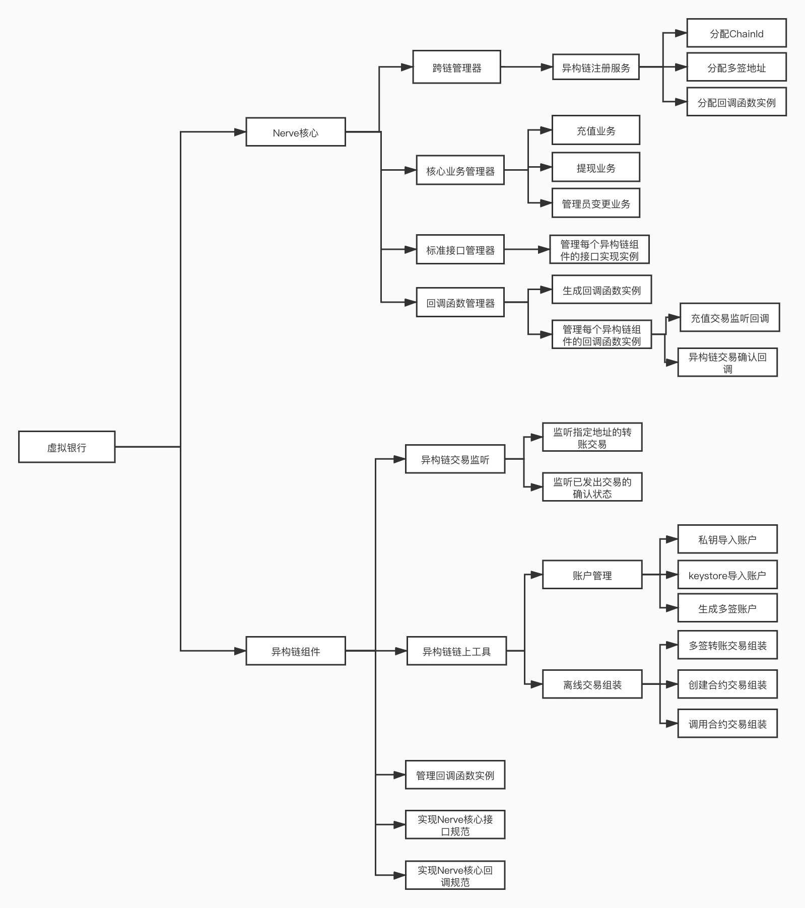
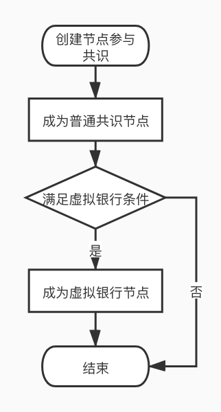
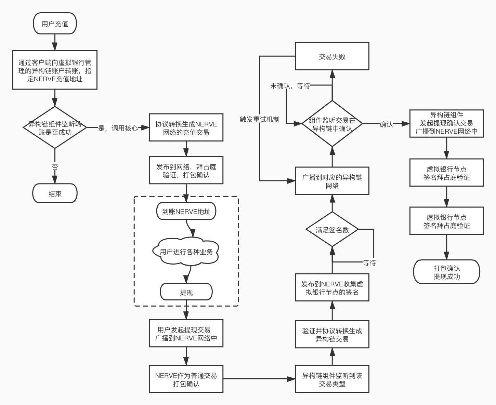

## Nerve异构跨链

### 为什么要有异构跨链Converter模块

​		Nerve 是一个去中心化的数字资产服务网络，旨在打破区块链价值孤岛，建立跨链互通的资产交互网络。Nerve 的跨链交互分为两个部分，一是NULS 跨链生态对接：以通用的 NULS 跨链协议为基础，实现NULS大生态中所有区块链的交互，此部分功能由跨链模块实现。 二是对比特币、以太坊等独立的公链，Nerve 定义一套接口协议，可以方便的实现各种不同区块链的交互，又需要有统一规范来管理运行，Converter模块就是用来实现该部分功能。

### 名称解释

#### 异构链

​		异构链是指不是基于NULS大生态下实现互相跨链交互的区块链，包括但不限于BTC、ETH。

#### 虚拟银行

​		虚拟银行是由NERVE网络中初始的（5个）种子出块节点与共识节点中的保证金总额排名前10个节点组成的异构链跨链管理机构。这些节点需要参与管理异构链的资产（管理方法是多签或者智能合约），虚拟银行负责监听跨链交易（转入和转出），并负责进行协议转换和交易确认。虚拟银行成员总数为15个，但是不能少于5个，如果少于5个则NERVE网络不能进行异构链跨链转入和转出操作。

####  虚拟银行管理账户

​		在NERVE中保管已对接的异构链账户或已转入NERVE的原资产的账户，在比特币中是多签地址，在以太坊中可能是智能合约。以BTC为例，虚拟银行成员各自提供一个BTC地址，创建一个多签地址，这个多签地址有虚拟银行管理，NERVE网络与BTC原始资产跨链交互就由这个账户来执行。

### Converter模块要做什么

​		制定一个通用的区块链异构跨链交互协议。通过这套标准的协议转换层，可以匹配通用的接口标准进行开发，接入更多主流的数字资产，形成一套通用的异构跨链交互协议。通过虚拟银行创建和管理多签地址（智能合约）， 并负责资产的转入验证和转出执行操作。

​		所有节点都要运行Converter模块，非虚拟银行节点只需运行部分功能虚拟银行节点：

- 处理完整的异构跨链业务，包含维护虚拟银行成员列表，进行账户的监听、交易的读取和发送，验证异构跨链交易，账户变更等业务交易。
- 普通节点、非虚拟银行共识节点：维护虚拟银行成员列表、验证异构跨链交易等。


### 整体业务结构图

Tips: 包含所有业务，包括异构链组件



### 核心业务

#### 核心业务总体流程图





#### ~~节点提交（追加、变更）异构链地址~~

​		~~NERVE网络中共识节点都有权加入虚拟银行，但是成为虚拟银行除了节点的基本信息外，还需要提供NERVE已对接的异构链的地址，在创建节点时可以同时提供该信息，也可以在成为节点后单独提交。~~

1. ~~节点通过发起提交异构链地址交易，可以同时提供单个或多个异构链地址。~~
2. ~~不允许提供空的异构链地址（变相移除地址等）。~~
3. ~~只需要提供节点自己持有的NERVE当前已对接的异构链账户地址，提交没有对接过的异构链地址是无效的。~~
4. ~~交易在NERVE确认后表示提交成功。~~
5. ~~再次提交相同异构链地址视为变更异构链地址。~~

~~值得注意的是提交异构链地址交易确认后可能引发虚拟银行成员的变化。~~

#### 维护虚拟银行管理员列表

虚拟银行准入和运行条件：

1. NERVE网络普通共识节点中保证金最高的10个节点，并且已提交NERVE已对接的所有异构链地址。
2. NERVE网络种子节点自动成为虚拟银行节点。
3. 虚拟银行成员总数为15个，但是不能少于5个，如果少于5个则NERVE网络不能进行异构链跨链转入和转出操作。

首次组网启动时还没有普通共识节点，所以虚拟银行的成员节点是全部种子节点，在异构链组件注册时虚拟银行需要提供管理的对应的多签地址或智能合约地址。将种子节点各自管理的异构链地址来生成多签地址或智能合约，并由虚拟银行管理，返回给注册的组件，由异构链组件监听该地址的异构链交易。

非首次启动节点，将共识发送的节点列表计算出当前虚拟银行成员列表，与DB中的虚拟银行节点进行比较，处理变更的节点信息。异构链注册时仍提供变更前的多签地址（智能合约地址）信息，变更的后的地址信息，由单独的变更接口处理。

#### 变更虚拟银行管理员

​	初始化5个种子节点成为虚拟银行，为了保证虚拟银行和异构跨链的稳定性，当网络中的共识节点总数达到20个的时候，开始启动虚拟银行变更服务。

​	虚拟银行变更交易触发条件，Converter模块同步每一个区块信息（包含节点信息），并记录虚拟银行成员的变化情况。

**每天固定时间只统计一次，检测到有变化则触发变更交易**：

- 满足虚拟银行条件的节点加入共识（新加入的节点如果没有提交异构链账户，则不会加入虚拟银行，也就不会导致虚拟银行节点变更）。

- 满足虚拟银行条件的节点提交或变更自己持有的异构链账户（允许创建节点时不提交，后面提交）。
- 已提交所有异构链地址的节点追加或减少保证金（影响排名）。

**检测到立即触发变更交易**：

- 普通（满足虚拟银行条件的？）共识节点数首次达到20。

- 虚拟银行成员节点退出共识。
- 虚拟银行成员节点移除自己持有的异构链账户（该功能有待确认）。

​		当网络中的共识节点变更，共识模块仍需要提供最新的节点信息列表。同时所有虚拟银行节点，将发起节点与异构链地址变更交易，所有节点生成同一笔交易，并进行签名拜占庭。交易在NERVE中确认时，则修改异构链的智能合约内部成员或多签地址。

修改多签地址扩展：

- 先按照当前最新的虚拟银行创建新的多签账户，但同时短暂保留旧的多签账户。
- 尽可能的避免因为账户变更带来的充值风险。


#### 异构链充值到Nerve

​		充值是指将异构链的资产转入NERVE网络中。该过程产生两笔交易，一是异构链内部的转账交易，将充值资产转入NERVE虚拟银行提供的指定监管账户，同时指定充值者自己的NERVE网络充值地址。二是NERVE网络产生一笔资产生成交易，生成出对应的充值资产，异构链原始资产由虚拟银行保管。

1. 在异构链（BTC、ETH）中向NERVE虚拟银行管理的多签账户或智能合约发起转账充值交易，交易中指明用户自己的充值地址（NERVE地址）。

2. Converter模块中已支持的异构链组件将各自监听虚拟银行所监管的多签账户或智能合约的交易，如确认充值交易则将原始交易数据通知虚拟银行。

3. 根据原始交易，生成NERVE协议的本链生成对应资产的异构链资产充值交易。由于每个虚拟银行节点都会收到该信息并生成这个交易，所以要保证节点生成的交易都必须一致（本地交易hash必须一致）。

   - 在生成异构链资产充值交易时必须带有原始交易的标识（可以是异构链原始充值交易hash），用于检测NERVE虚拟银行节点本地生成交易与其他节点发送交易的一致性问题。
   - 充值时虚拟银行不对充值的资产收取手续费。

4. 虚拟银行对该笔本地交易签名，并收集其他虚拟银行的签名，当签名数量达到最小签名数后，该笔交易可以打包。

   PS：具体实现可参考共识验证人变更等交易的处理方式。

5. 交易验证：

   a. 本节点是普通节点（非虚拟银行），则只进行基础验证和签名拜占庭验证。

   b. 本节点是虚拟银行节点（分为对收到的交易进行签名前的验证、打包验证）：

   - 新交易接收：验证交易本身是否正确，本地如果已进行了签名，则证明是正确的，如果本地为进行签名，则验证原始交易是否存在，hash是否和自己生成的一致。
   - 打包验证：基础验证和拜占庭签名验证。

6. 打包确认该交易，并将新生成的外链资产授予充值账户。

#### Nerve提现到异构链

​		提现指将NERVE中的异构链资产，转入对应的异构链中去。该过程将产生两笔交易，一是异构链资产提现交易，NERVE网络中的异构跨链转出交易（资产销毁）；二是异构链网络转账交易，将对应数额的资产从虚拟银行管理的对应的异构链多签账户或智能合约中转出到用户提现的账户中。

1. 由用户发起提现（命令行、GUI钱包等）指定异构链、异构链地址、资产类型、资产数量、备注信息。
   1. NERVE内部提现交易是否为一个对黑洞地址转账的资产销毁交易？
   2. 将对应的eth账户，生成一个外链账户，作为资产的接收方，这样也保证了资产永久锁定（chainId为eth链的id，所以不能交易）？
2. 提现手续费，发起提现时收取nvt到固定nerve地址，虚拟银行异构链交易成功（合约签名成功）后，由该固定的nerve地址分发给对应的虚拟银行节点（谁花费了异构链手续费，谁就可以得到nvt手续费补偿）
3. NERVE网络中交易打包确认（按照常规交易处理）。
4. 虚拟银行节点监听到该类型交易，验证该交易确定已在NERVE中确认，并转换生成异构链网络转账交易，并且所有节点都需要根据NERVE中已确认提现交易的数据来生成，保证各节点生成的交易数据一致。
   - 生成的异构链网络转账交易要包含NERVE提现交易hash，例如写在备注等。
5. 虚拟银行节点对异构链网络转账交易进行签名拜占庭验证。
6. 当交易签名足够时，通过Converter模块对应的异构链组件发送交易到异构链。
   - 异构链组件：异构链网络转账交易如果长时间不能确认，则需要重发机制（避免交易重放）。
7. 当该交易在异构链确认后（由组件监控），通知虚拟银行提交一笔提现完成交易到NERVE中。


#### 异构链交易状态确认交易

异构链网络转账交易在异构链网络中确认后的，在NERVE本地网络的确认交易，表示提现成功。

1. 异构链组件监听提现交易在异构链的确认状态，并回调NERVE核心。
2. 虚拟银行节点根据异构链组件的回调信息，生成异构链交易状态确认交易。
3. 虚拟银行各节点生成的该笔交易必须一致。该确认交易包含异构链网络转账交易的hash和NERVE提现交易的hash。
4. 虚拟银行节点对该交易签名拜占庭，打包确认。


#### 提案交易

提案交易主要是在NERVE网络异构跨链过程中出现的一些不可预见的问题，提供处理机制的底层支持。主要有以下几种处理类型：

- 退回资金
- 转到其他账户
- 冻结账户
- 解冻账户
- 踢出节点
- 其他类型

提案的流程

1. 用户发起提案交易，交易携带提案的内容，发布到网络，NERVE网络打包确认。
2. 钱包可以展示该提案交易内容。
3. 各虚拟银行节点在规定时间内必须发起投票交易，表示同意或不同意该提案。
4. 所有节点都要计算该投票结果。
5. 提案状态：投票中、执行中（通过率达到66%）、未通过（反对率达到34%）、已归档（没有足够人投票）、已完成（提案执行完成）。

发起提案需要支付额外的手续费，该手续费由发起投票的虚拟银行节点获得。发起提案时该手续费转账到固定的NERVE网络地址，该地址只能由系统交易（支付手续费）转出Token，不能发起普通交易。（与提现手续费流程类似）

#### 投票交易

投票交易虚拟银行针对某个提案进行投票的交易，表示同意或不同意该提案。

投票交易只能由各虚拟银行节点发起。

虚拟银行节点必须发起针对每一个提案的投票交易。


### NERVE交易协议

NERVE的交易协议采用基于NULS的通用交易协议格式，主要由以下字段组成：

| Len  | Fields   | Data Type | Remark             |
| ---- | -------- | --------- | ------------------ |
| 2    | type     | uint16    | 交易类型           |
| 4    | time     | uint32    | 时间，精确到秒     |
| ？   | txData   | VarByte   | 业务数据           |
| ？   | coinData | VarByte   | 资产数据           |
| ？   | remark   | VarString | 备注               |
| ？   | sigData  | VarByte   | 包含公钥和签名数据 |

#### Converter中各交易业务数据(txData)协议

##### ~~节点提交异构链地址交易~~

~~交易中异构链地址需对应注册异构链的chainId~~

~~**txData**：SubmitOuterAddressTxData~~

| ~~Len~~ | ~~Fields~~                   | ~~Data Type~~ | ~~Remark~~         |
| ------- | ---------------------------- | ------------- | ------------------ |
| ~~23~~  | ~~agentAddress~~             | ~~VarByte~~   | ~~节点地址~~       |
| ~~？~~  | ~~heterogeneousAddressList~~ | ~~VarByte~~   | ~~异构链地址集合~~ |

#####  虚拟银行管理员变更交易

由于Converter的虚拟银行会管理多个异构链账户，因此在虚拟银行成员变更时，允许节点同时提交多个异构链地址。

**txData**：ChangeVirtualBankTxData

| Len  | Fields    | Data Type | Remark               |
| ---- | --------- | --------- | -------------------- |
| ?    | outAgents | VarByte   | 退出虚拟银行节点地址 |
| ?    | inAgents  | VarByte   | 加入虚拟银行节点地址 |

##### 充值交易Recharge

**txData**：RechargeTxData

| Len  | Fields              | Data Type | Remark             |
| ---- | ------------------- | --------- | ------------------ |
| ？   | heterogeneousTxHash | VarByte   | 异构链充值交易hash |


##### 提现交易Withdrawal

**txData**：WithdrawalTxData

| Len  | Fields               | Data Type | Remark                      |
| ---- | -------------------- | --------- | --------------------------- |
| 2    | chainId              | uint16    | 提现的异构链在NERVE中的链ID |
| ?    | heterogeneousAddress | VarByte   | 提现到账的对应异构链地址    |

coinData示例

| From                        | To                                              |
| --------------------------- | ----------------------------------------------- |
| Coin1：10NVT 异构提现手续费 | 特殊账户 9NVT （多出一个为NERVE网络打包手续费） |
| Coin2：100ETH 提现资产金额  | NERVE网络的异构地址100ETH（类似黑洞）           |


##### 异构链交易状态确认交易

**txData**：ConfirmWithdrawalTxData

| Len  | Fields              | Data Type | Remark                         |
| ---- | ------------------- | --------- | ------------------------------ |
| 8    | heterogeneousHeight | uint64    | 异构链中对应的提现交易确认高度 |
| ？   | heterogeneousTxHash | VarByte   | 异构链中对应的提现交易hash     |
| 32   | withdrawalTxHash    | VarByte   | NERVE网络中对应的提现交易hash  |


##### 提案交易

**txData**：ProposalTxData

| Len  | Fields              | Data Type | Remark                                   |
| ---- | ------------------- | --------- | ---------------------------------------- |
| ？   | heterogeneousTxHash | VarByte   | 原始交易hash（比如充值的异构链交易hash） |
| 23   | address             | VarByte   | NERVE地址（账户、节点地址等）            |
| 1    | type                | byte      | 提案类型                                 |
| ？   | content             | VarByte   | 提案内容                                 |

coinData示例

| From                           | To                                              |
| ------------------------------ | ----------------------------------------------- |
| Coin1：10NVT（发起提案总花费） | 特殊账户 9NVT （多出一个为NERVE网络打包手续费） |


##### 投票交易

**txData**：VoteProposalTxData

| Len  | Fields         | Data Type | Remark                      |
| ---- | -------------- | --------- | --------------------------- |
| 32   | proposalTxHash | VarByte   | 提案交易hash                |
| 1    | choice         | byte      | 是否同意提案内容 0否，1同意 |

 

### 异构链组件

#### 总体流程图


#### 异构链组件主要职责

- 根据私钥或者keystore保存异构链账户
- 导出账户keystore文件
- 验证账户密码是否正确
- 查询账户详情
- 查询账户列表
- 移除账户
- 验证地址格式
- 查询地址余额
- 创建异构链多签地址
    - 根据提供的公钥和最小签名数，生成多签地址
    - 若是多签合约，此处返回空
- 更新指定的多签地址
- 监听异构链上指定地址的交易
    - 解析异构链区块交易，发送指定地址交易到Nerve核心
        - Nerve核心会指定监听地址 
- 组装异构链交易并发送交易
    - Nerve核心会发起两种类型的交易
        - 提现交易，即异构链网络实现多签功能的转账交易
        - 管理员变更交易，即异构链网络实现多签功能的地址的多签成员变更
            - ETH网络调用合约实现多签成员变更
            - BTC网络直接变更多签地址，不用发出链上交易
- 确认异构链交易状态
    - 当交易发送到异构链上后，异构链组件内要监听这笔交易的状态，若交易成功确认，则要通知Nerve核心

#### 实现Nerve核心接口规范

- 接口列表

    ```java
    public interface IHeterogeneousChainDocking {
      
      	/**
         * 当前链是否支持合约资产
         */
        boolean isSupportContractAssetByCurrentChain();
      	/**
         * 当前异构链ID
         */
        Integer getChainId();
        /**
         * 根据压缩公钥生成异构链地址
         */
        String generateAddressByCompressedPublicKey(String compressedPublicKey);
      	/**
         * 根据私钥导入地址，只允许导入一个地址，新导入的将覆盖已有的
         */
        HeterogeneousAccount importAccountByPriKey(String priKey, String password) throws NulsException;
        /**
         * 根据keystore导入地址，只允许导入一个地址，新导入的将覆盖已有的
         */
        HeterogeneousAccount importAccountByKeystore(String keystorePath, String password) throws NulsException;
        /**
         * 验证账户密码是否正确
         */
        boolean validateAccountPassword(String address, String password) throws NulsException;
      	/**
         * 查询账户详情
         */
        HeterogeneousAccount getAccount(String address);
        /**
         * 查询账户列表
         */
        List<HeterogeneousAccount> getAccountList();
        /**
         * 移除账户
         */
        public void removeAccount(String address) throws Exception;
        /**
         * 验证地址格式
         */
        boolean validateAddress(String address);    
        /**
         * 查询地址余额
         * @return 地址余额
         */
        BigDecimal getBalance(String address);
        /**
         * 创建多签地址
         * @return 多签地址
         */
        String createMultySignAddress(String[] pubKeys, int minSigns);
        /**
         * 确认异构链的交易状态
         */
        void txConfirmedCompleted(String txHash, Long blockHeight) throws Exception;
        /**
         * 回滚`确认异构链的交易状态`
         */
        void txConfirmedRollback(String txHash) throws Exception;
      	/**
         * 根据合约地址查询异构链合约资产信息
         */
        HeterogeneousAssetInfo getAssetByContractAddress(String contractAddress);
      	/**
         * 根据资产ID查询异构链资产信息
         */
        HeterogeneousAssetInfo getAssetByAssetId(int assetId);
      	/**
         * 获取当前异构链下所有的初始资产
         */
        List<HeterogeneousAssetInfo> getAllInitializedAssets();
      	/**
         * 从异构链网络上查询异构链合约资产信息，验证资产数据是否正确
         */
        boolean validateHeterogeneousAssetInfoFromNet(String contractAddress, String symbol, int decimals);
      	/**
         * 保存异构链合约资产
         */
        void saveHeterogeneousAssetInfos(List<HeterogeneousAssetInfo> assetInfos) throws Exception;
      	/**
         * 回滚异构链合约资产
         */
        void rollbackHeterogeneousAssetInfos(List<HeterogeneousAssetInfo> assetInfos) throws Exception;
        /**
         * 获取充值交易信息
         *
         * @return 交易信息
         */
        HeterogeneousTransactionInfo getDepositTransaction(String txHash);
        /**
         * 获取提现交易信息
         *
         * @return 交易信息
         */
        HeterogeneousTransactionInfo getWithdrawTransaction(String txHash);
      	/**
         * 获取变更管理员确认交易的信息
         */  
      	HeterogeneousConfirmedInfo getChangeVirtualBankConfirmedTxInfo(String txHash);
      	/**
         * 创建或签名提现交易
         * @return 异构链交易hash
         */
        String createOrSignWithdrawTx(String txHash, String toAddress, BigInteger value, Integer assetId) throws NulsException;
        /**
         * 创建或签名管理员变更交易
         * @return 异构链交易hash
         */
        String createOrSignPersonnelChangesTx(String txHash, String[] addAddresses,
                                              String[] removeAddresses, String[] currentAddresses) throws NulsException;
    }
    ```

- 接口 `getBalance`
  
    - 接口参数: 

        | 字段名             |  字段类型  | 参数描述         |
        | --------------- |:------:| ------------ |
        | address         | string | 地址      |
    
    - 接口返回:

        | 字段名             |  字段类型  | 参数描述         |
        | --------------- |:------:| ------------ |
        | balance  | string | 地址余额      |

    - 接口校验:
      
    - 空值校验
      
    - 接口要求:
    
      - 计算异构链主资产的真实余额(**非去小数化**)
  
- 接口 `createMultySignAddress`
  
    - 接口参数: 

        | 字段名             |  字段类型  | 参数描述         |
        | --------------- |:------:| ------------ |
        | pubKeys         | string[] | 公钥Hex码数组      |
        | minSigns        | int | 最小签名数       |
    
    - 接口返回:

        | 字段名             |  字段类型  | 参数描述         |
        | --------------- |:------:| ------------ |
        | multySignAddress  | string | 多签地址      |

    - 接口校验:
        - 空值校验
        - 最小签名数不得大于公钥Hex码数组长度
    
    - 接口要求:
        - 若异构链支持多签地址，则创建多签地址返回
        - 若异构链不支持多签地址，则返回空
    
- 接口 `getTransaction `
  
    - 接口参数: 

        | 字段名             |  字段类型  | 参数描述         |
        | --------------- |:------:| ------------ |
        | txHash         | string | 交易hash      |
    
    - 接口返回:
      
        | 字段名             |  字段类型  | 参数描述         |
        | --------------- |:------:| ------------ |
        | HeterogeneousTransactionInfo  | object | 交易信息     |
        
        - HeterogeneousTransactionInfo 对象结构: 
        
            | 字段名             |  字段类型  | 参数描述         |
            | --------------- |:------:| ------------ |
            | txHash         | string | 交易hash        |
            | blockHeight         | long | 交易打包的区块高度        |
            | from         | string | 转出地址        |
            | to         | string | 转入地址        |
            | value         | string | 转账金额        |
            | txTime         | long | 交易时间        |
            | remark         | string | 交易备注        |
        
    - 接口校验:
      
    - 空值校验
  
- 接口 `createOrSignWithdrawTx`
  
    - 接口参数: 

        | 字段名             |  字段类型  | 参数描述         |
        | --------------- |:------:| ------------ |
        | txHash         | string | 本链提现交易hash      |
        | toAddress        | string | 异构链提现接收地址       |
        | value        | string | 提现金额       |
        | isContractAsset        | boolean | 是否为合约资产       |
        | contractAddress        | string | 合约资产的合约地址      |
        | manager        | string | 签名管理员地址       |
        | managerPriKey        | string | 签名管理员地址私钥       |
    
    - 接口返回:

        | 字段名             |  字段类型  | 参数描述         |
        | --------------- |:------:| ------------ |
        | txHash | string | 异构链交易hash |

    - 接口校验:
        - 交易是否已完成
        - 签名数是否已达成
        - 管理员是否已签名
    
    - 接口要求:
        - 管理员调用此接口，未创建交易时，创建交易并签名
        - 已创建交易，则签名交易
        - 达成签名数后，执行提现 

- 接口 `createOrSignPersonnelChangesTx`
  
    - 接口参数: 

        | 字段名             |  字段类型  | 参数描述         |
        | --------------- |:------:| ------------ |
        | txHash         | string | 本链变更交易hash      |
        | addAddresses | string | 加入的管理员地址列表  |
        | removeAddresses | string | 退出的管理员地址列表   |
        | currentAddresses | string | 当前管理员地址列表 |
        | manager        | string | 签名管理员地址       |
        | managerPriKey        | string | 签名管理员地址私钥       |
        |  |  |  |

    - 接口返回:
    
        | 字段名             |  字段类型  | 参数描述         |
    | --------------- |:------:| ------------ |
        | txHash | string | 异构链交易hash |
    
    - 接口校验:
        - 交易是否已完成
        - 签名数是否已达成
        - 管理员是否已签名
    
    - 接口要求:
        - 管理员调用此接口，未创建交易时，创建交易并签名
        - 已创建交易，则签名交易
        - 达成签名数后，执行变更
        
#### 异构链组件初始化

- 调用Nerve核心跨链注册接口 `RegiterHeterogeneousChain#register`
    - 注册异构链名称，如 `eth, btc, neo`
    - 注册组件内实现的 `HeterogeneousChainInterface`接口实例
- Nerve核心注册接口说明

    ```java
    public interface RegiterHeterogeneousChain {
        /**
         * @param chainName 交易hash
         * @param HeterogeneousChainInterface Nerve核心接口实现实例
         */
        HeterogeneousChainRegisterInfo register(String chainName, HeterogeneousChainInterface heterogeneousChainInterface);
    }
    
    public class HeterogeneousChainRegisterInfo {
        /**
         * 多签地址
         * 用于充值、提现或人事变更
         */
        private String multiSigAddress;
        /**
         * 充值交易提交器
         * 用于异构链组件解析到监听的交易，发送给Nerve核心组件
         */
        private DepositTxSubmitter depositTxSubmitter;
        /**
         * 发送的提现或者人事变更交易的状态确认器
         * 用于异构链交易确认后，发送给Nerve核心组件
         */
        private TxConfirmedProcessor txConfirmedProcessor;
    }
    ```
    
- **Nerve核心注册接口返回值说明**
    - 当异构链组件向Nerve核心注册后，Nerve核心将返回三个数据
        - 多签地址，用于充值、提现或人事变更
        - 充值交易提交器，用于异构链组件解析到监听的交易，发送给Nerve核心组件
        - 交易状态确认器，用于异构链交易确认后，发送给Nerve核心组件
        
#### 业务回调规范

- **业务:** 监听指定地址异构链交易
  
- 调用`IDepositTxSubmitter#txSubmit`，把监听交易发送给Nerve核心 
  
- **业务:** 异构链发送到异构链上的多签转账交易、多签成员变更交易确认后
  
- 调用`ITxConfirmedProcessor#txConfirmed`，把确认信息发送给Nerve核心 
  
- **回调接口说明**
    - **从Nerve核心注册接口的返回值中获取回调接口实例**
    - 充值交易提交器
    
        ```java
        public interface IDepositTxSubmitter {
            /**
             * @param txHash          交易hash
             * @param blockHeight     交易确认高度
             * @param from            转出地址
             * @param to              转入地址
             * @param value           转账金额
             * @param txTime          交易时间
             * @param decimals        资产小数位数
             * @param ifContractAsset 是否为合约资产
             * @param contractAddress 合约地址
             * @param assetId         资产ID
             * @param nerveAddress    Nerve充值地址
             */
            void txSubmit(String txHash, Long blockHeight, String from, String to, BigInteger value, Long txTime, Integer decimals, Boolean ifContractAsset, String contractAddress, Integer assetId, String nerveAddress);
        }
        ```
    
    - 交易状态确认器
    
        ```java
        public interface ITxConfirmedProcessor {
            /**
             * @param orginTxHash 本链交易hash
             * @param txHash 异构链交易hash
             * @param blockHeight 异构链交易确认高度
             * @param txTime 异构链交易时间
             */
            void txConfirmed(String orginTxHash, String txHash, Long blockHeight, 
                                Long txTime);
        }
        ```

#### 异构链组件业务分解

- 异构链充值到Nerve
    - 组件初始化，向Nerve核心注册，得到多签地址(监听地址)、Nerve核心回调接口实例之一（**交易提交器**）
    - 组件监听异构链指定地址的交易
        - 等待交易确认高度超过规定高度，如BTC网络6个确认高度，ETH网络30个确认高度 
    - 把监听到的交易通过回调接口发送给Nerve核心
    
- Nerve提现到异构链
    - 组件初始化，向Nerve核心注册，得到多签地址(提现地址)、Nerve核心回调接口实例之一（**交易状态确认器**）
    - Nerve核心发起了异构链上多签转账交易后(**提现交易**)，组件内要监听此异构链上交易状态
        - 等待交易确认高度超过规定高度，如BTC网络6个确认高度，ETH网络30个确认高度 
    - 异构链上的交易达到确认规则后，通过回调接口发送给Nerve核心
    - Nerve核心收到回调信息后，发起一笔状态确认交易，需要拜占庭签名等操作……
    
- 变更虚拟银行管理员
    - 组件初始化，向Nerve核心注册，得到多签地址、Nerve核心回调接口实例之一（**交易状态确认器**）
    - ETH网络（**支持多签合约的区块链网络**）
        - Nerve核心发起了异构链上多签成员变更交易后(**管理员变更交易**)，组件内要监听此异构链上交易状态
            - 等待交易确认高度超过规定高度，如ETH网络30个确认高度 
        - 异构链上的交易达到确认规则后，通过回调接口发送给Nerve核心
        - Nerve核心收到回调信息后，发起一笔状态确认交易，需要拜占庭签名等操作……
    - BTC网络（**仅支持多签地址的区块链网络**）
        - 由于BTC网络是多签地址，可离线生成地址，因此Nerve核心发起了异构链上多签成员变更交易后(**管理员变更交易**)，即可当做此管理员确认了交易，组件内立即调用回调接口，把交易确认信息发送给Nerve核心
        - Nerve核心收到回调信息后，发起一笔状态确认交易，需要拜占庭签名等操作……

### 异常情况
1. 多签成员地址手续费不足
2. 充值失败，未监听到异构链交易
3. 提现失败，发出异构链交易没成功


