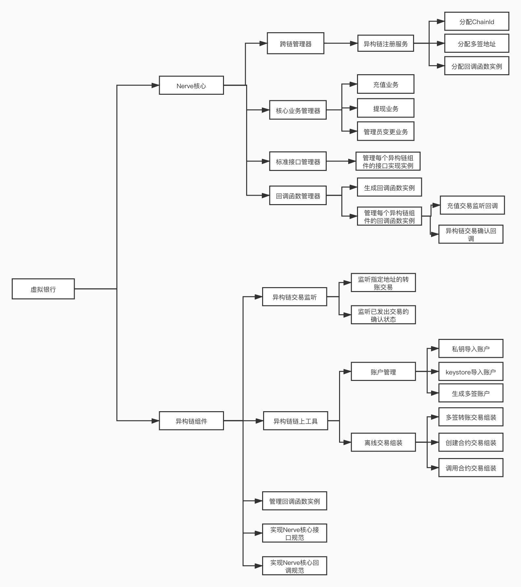
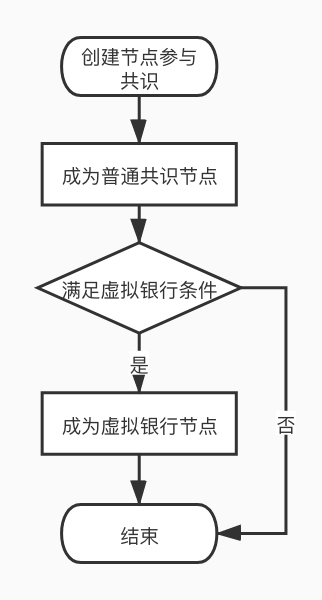
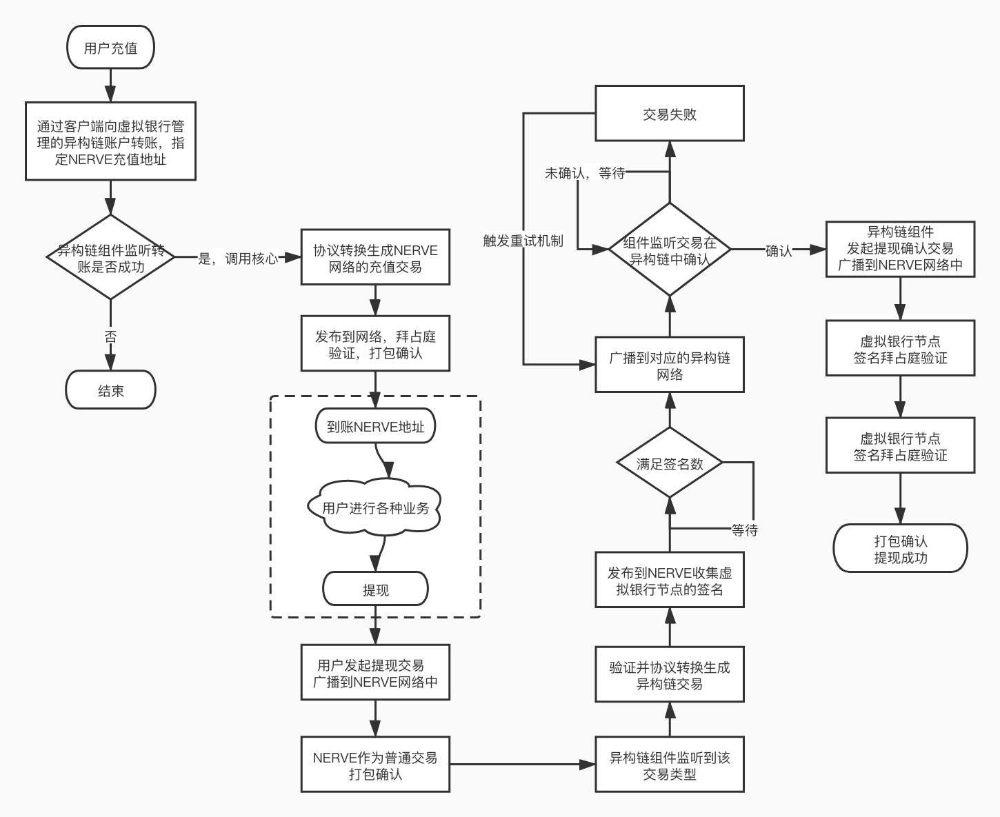
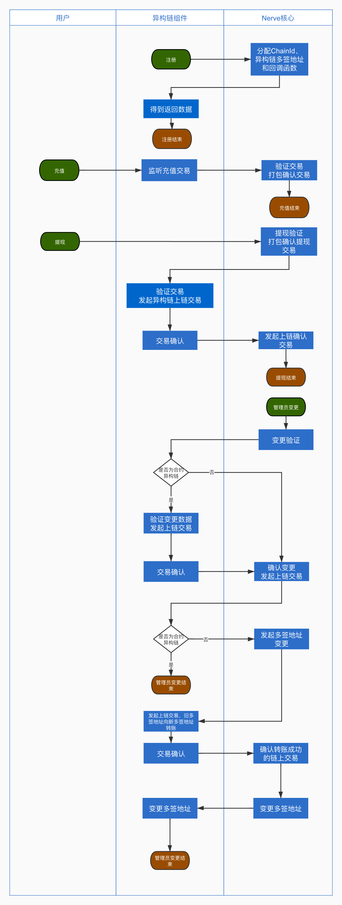

## NerveHeterogeneous cross chain

### Why should there be heterogeneous cross chainConvertermodule

​		Nerve It is a decentralized digital asset service network aimed at breaking down blockchain value silos and establishing a cross chain interoperability asset exchange network.Nerve The cross chain interaction of is divided into two parts, one isNULS Cross chain ecological docking：With universal NULS Based on cross chain protocols, implementingNULSThe interaction of all blockchains in the ecosystem is achieved through cross chain modules. The second is to compare special coins、Independent public chains such as Ethereum,Nerve Defining a set of interface protocols can facilitate the interaction between various blockchains, while also requiring a unified standard to manage and operate,ConverterThe module is used to implement this part of the function.

### Name Explanation

#### Heterogeneous chain

​		Heterogeneous chain refers to a chain that is not based onNULSImplementing blockchain for cross chain interaction in the big ecosystem, including but not limited toBTC、ETH.

#### Virtual banking

​		Virtual banking is created byNERVEInitial in the network（5individual）Ranking top in total margin between seed block nodes and consensus nodes10A heterogeneous cross chain management organization composed of nodes. These nodes need to participate in managing assets of heterogeneous chains（The management method is to sign multiple contracts or smart contracts）Virtual banks are responsible for monitoring cross chain transactions（Transfer in and out）And responsible for protocol conversion and transaction confirmation. The total number of virtual bank members is15Number, but not less than5If it is less than5Individual rulesNERVEThe network cannot perform heterogeneous chain cross chain in and out operations.

####  Virtual Bank Management Account

​		stayNERVEInterested heterogeneous chain accounts or transferred accounts that have been linked to China CustodyNERVEThe account of the original asset in Bitcoin may have multiple signed addresses, while in Ethereum it may have a smart contract. withBTCFor example, virtual bank members each provide aBTCAddress, create a multi signature address that is managed by a virtual bank,NERVENetwork andBTCThe cross chain interaction of the original asset is executed by this account.

### ConverterWhat modules need to do

​		Develop a universal blockchain heterogeneous cross chain interaction protocol. Through this standard protocol conversion layer, it is possible to match common interface standards for development, integrate more mainstream digital assets, and form a universal heterogeneous cross chain interaction protocol. Creating and managing multiple signed addresses through virtual banking（Smart contracts）, And responsible for verifying the transfer in and out of assets.

​		All nodes must runConverterModule, non virtual banking nodes only need to run partial functions. Virtual banking nodes：

- Handle complete heterogeneous cross chain business, including maintaining a virtual bank member list and monitoring accounts、Read and send transactions, verify heterogeneous cross chain transactions, account changes, and other business transactions.
- Normal node、Non Virtual Bank Consensus Node：Maintain virtual bank member list、Verify heterogeneous cross chain transactions, etc.


### Overall business structure diagram

Tips: Includes all businesses, including heterogeneous chain components



### core business

#### Overall flowchart of core business





#### ~~Node submission（Add、change）Heterogeneous Chain Address~~

​		~~NERVEConsensus nodes in the network have the right to join virtual banks, but becoming a virtual bank requires not only basic information about the nodes, but also the provision ofNERVEThe address of the connected heterogeneous chain can be provided simultaneously when creating a node, or it can be submitted separately after becoming a node.~~

1. ~~Nodes can provide single or multiple heterogeneous chain addresses simultaneously by initiating and submitting heterogeneous chain address transactions.~~
2. ~~Not allowed to provide empty heterogeneous chain addresses（Remove addresses in disguised form, etc）.~~
3. ~~Just provide the nodes that they ownNERVESubmitting a heterogeneous chain account address that has not been connected to the currently connected heterogeneous chain account address is invalid.~~
4. ~~Transaction inNERVEAfter confirmation, it indicates successful submission.~~
5. ~~Submitting the same heterogeneous chain address again is considered a change in the heterogeneous chain address.~~

~~It is worth noting that submitting heterogeneous chain address transaction confirmations may cause changes in virtual bank members.~~

#### Maintain a list of virtual bank administrators

Access and operating conditions for virtual banks：

1. NERVEThe highest margin among ordinary consensus nodes in the network10Nodes, and submittedNERVEAll heterogeneous chain addresses that have been docked.
2. NERVEThe network seed node automatically becomes a virtual bank node.
3. The total number of virtual bank members is15Number, but not less than5If it is less than5Individual rulesNERVEThe network cannot perform heterogeneous chain cross chain in and out operations.

When the network is first started, there are no ordinary consensus nodes, so the member nodes of the virtual bank are all seed nodes. When registering heterogeneous chain components, the virtual bank needs to provide corresponding multi signature addresses or smart contract addresses for management. Generate multiple signed addresses or smart contracts from the heterogeneous chain addresses managed by each seed node, which are managed by virtual banks and returned to the registered components. The heterogeneous chain components listen to the heterogeneous chain transactions at that address.

Non initial startup node, calculate the current virtual bank member list based on the node list sent by consensus, andDBCompare the virtual banking nodes in and process the changed node information. Provide multiple signed addresses before the change during heterogeneous chain registration（Smart contract address）Information, the changed address information, is processed by a separate change interface.

#### Change virtual bank administrator

​	initialization5A seed node becomes a virtual bank. In order to ensure the stability of the virtual bank and heterogeneous cross chain, when the total number of consensus nodes in the network reaches20At that time, we will start the virtual banking change service.

​	Virtual banking changes transaction triggering conditions,ConverterModule synchronizes information for each block（Include node information）And record the changes in virtual bank members.

**Only count once a day at a fixed time, and trigger change transactions if changes are detected**：

- Nodes that meet the conditions for virtual banking join consensus（If a newly added node does not submit a heterogeneous chain account, it will not join the virtual bank and will not cause any changes to the virtual bank node）.

- Nodes that meet the conditions for virtual banking submit or change their own heterogeneous chain accounts（Allow not to submit when creating nodes, submit later）.
- All nodes with heterogeneous chain addresses have submitted additional or reduced security deposits（Impact ranking）.

**Immediate triggering of change transaction detected**：

- ordinary（Those who meet the conditions for virtual banking？）The number of consensus nodes reached for the first time20.

- Virtual bank member node exit consensus.
- Virtual bank member nodes remove their own heterogeneous chain accounts（This function needs to be confirmed）.

​		When the consensus nodes in the network change, the consensus module still needs to provide the latest node information list. At the same time, all virtual banking nodes will initiate address change transactions with heterogeneous chains, and all nodes will generate the same transaction and sign Byzantium. Transaction inNERVEWhen confirming, modify the internal members or multi signature addresses of the smart contract of the heterogeneous chain.

Modify multi signature address extension：

- First, create a new multi signature account based on the latest virtual bank, but temporarily retain the old multi signature account.
- Try to avoid the recharge risk caused by account changes as much as possible.


#### Heterogeneous chain recharge toNerve

​		Recharge refers to transferring assets from heterogeneous chainsNERVEIn the network. This process generates two transactions, one of which is a transfer transaction within a heterogeneous chain, transferring recharged assets into itNERVEThe designated regulatory account provided by the virtual bank, along with the designated recharger's own accountNERVENetwork recharge address. The second is thatNERVEThe network generates an asset generation transaction, generating corresponding recharge assets, and the original assets of heterogeneous chains are kept by virtual banks.

1. In heterogeneous chains（BTC、ETH）Middle directionNERVEMultiple signed accounts or smart contracts managed by virtual banks initiate transfer and recharge transactions, with the user's own recharge address specified in the transaction（NERVEaddress）.

2. ConverterThe supported heterogeneous chain components in the module will each listen to transactions of multi signed accounts or smart contracts supervised by the virtual bank. If the recharge transaction is confirmed, the original transaction data will be notified to the virtual bank.

3. Generate based on the original transactionNERVEThe protocol generates heterogeneous chain asset recharge transactions for the corresponding assets in this chain. Since each virtual banking node receives this information and generates this transaction, it is necessary to ensure that the transactions generated by the node are consistent（Local transactionshashMust be consistent）.

   - When generating heterogeneous chain asset recharge transactions, the identification of the original transaction must be included（It can be a heterogeneous chain original recharge transactionhash）, used for detectionNERVEThe consistency issue between locally generated transactions of virtual banking nodes and transactions sent by other nodes.
   - When recharging, virtual banks do not charge transaction fees for the recharged assets.

4. The virtual bank signs the local transaction and collects signatures from other virtual banks. When the number of signatures reaches the minimum number, the transaction can be packaged.

   PS：The specific implementation can refer to the handling methods of transactions such as consensus verifier changes.

5. Transaction verification：

   a. This node is a regular node（Non virtual banking）Only basic verification and signature Byzantine verification will be performed.

   b. This node is a virtual banking node（Divided into pre signature verification of received transactions、Packaging verification）：

   - New transaction reception：Verify if the transaction itself is correct. If it has been signed locally, it proves to be correct. If it has not been signed locally, verify if the original transaction exists,hashWhether it is consistent with the one generated by oneself.
   - Packaging verification：Basic verification and Byzantine signature verification.

6. Package and confirm the transaction, and grant the newly generated external chain assets to the recharge account.

#### NerveWithdrawal to heterogeneous chains

​		Withdrawal refers to the withdrawal of fundsNERVETransfer the heterogeneous chain assets in the corresponding heterogeneous chain. This process will generate two transactions, one is the heterogeneous chain asset withdrawal transaction,NERVEHeterogeneous cross chain transfer transactions in the network（Asset destruction）；The second is heterogeneous chain network transfer transactions, which transfer the corresponding amount of assets from the corresponding heterogeneous chain multi signature account or smart contract managed by the virtual bank to the user's withdrawal account.

1. User initiated withdrawal（command line、GUIWallets, etc）Specify heterogeneous chains、Heterogeneous Chain Address、Asset type、Asset quantity、Note information.
   1. NERVEIs the internal withdrawal transaction an asset destruction transaction that involves transferring funds to a black hole address？
   2. Translate the correspondingethAccount, generate an external link account as the recipient of the asset, which also ensures that the asset is permanently locked（chainIdbyethChain basedidSo we cannot trade）？
2. Withdrawal handling fee, collected when initiating withdrawalnvtTo fixednerveAddress, virtual bank heterogeneous chain transaction successful（Contract signed successfully）Afterwards, the fixednerveDistribute addresses to corresponding virtual bank nodes（Whoever spends the heterogeneous chain handling fee can receive itnvtCompensation for handling fees）
3. NERVEConfirmation of transaction packaging in the network（Handle according to regular transactions）.
4. The virtual bank node has detected this type of transaction and verified that it has been processedNERVEConfirm and convert to generate heterogeneous chain network transfer transactions, and all nodes need to follow theNERVEGenerate transaction data based on confirmed withdrawal transactions, ensuring consistency in transaction data generated by each node.
   - The generated heterogeneous chain network transfer transaction should includeNERVEWithdrawal transactionshashFor example, write in notes, etc.
5. Virtual banking nodes perform signature Byzantine verification on heterogeneous chain network transfer transactions.
6. When the transaction signature is sufficient, it is passed throughConverterThe heterogeneous chain component corresponding to the module sends transactions to the heterogeneous chain.
   - Heterogeneous Chain Components：If the heterogeneous chain network transfer transaction cannot be confirmed for a long time, a resend mechanism is required（Avoiding transaction replay）.
7. When the transaction is confirmed in the heterogeneous chain（Monitoring by components）Notify the virtual bank to submit a withdrawal to complete the transactionNERVEMedium.


#### Heterogeneous chain transaction status confirmation transaction

After confirming the heterogeneous chain network transfer transaction in the heterogeneous chain networkNERVEConfirmed transactions on the local network indicate successful withdrawal.

1. Heterogeneous chain components monitor the confirmation status of withdrawal transactions in heterogeneous chains and call backNERVECore.
2. The virtual bank node generates heterogeneous chain transaction status confirmation transactions based on the callback information of heterogeneous chain components.
3. The transaction generated by each node of the virtual bank must be consistent. This confirmation transaction includes heterogeneous chain network transfer transactionshashandNERVEWithdrawal transactionshash.
4. The virtual bank node signs the transaction in Byzantium and packages it for confirmation.


#### Proposal transaction

The proposal transaction mainly involvesNERVEProvide underlying support for addressing unforeseen issues that may arise during network heterogeneity and cross chain processes. There are mainly the following types of processing：

- Refund of funds
- Transfer to another account
- Freeze account
- Unfreezing accounts
- Kick out nodes
- Other types

Proposal process

1. The user initiates a proposal transaction, which carries the content of the proposal and is published on the network,NERVENetwork packaging confirmation.
2. The wallet can display the transaction content of the proposal.
3. Each virtual banking node must initiate a voting transaction within the specified time, indicating agreement or disagreement with the proposal.
4. All nodes need to calculate the voting result.
5. Proposal status：In voting、In progress（The pass rate has reached66%）、Not passed（The opposition rate has reached34%）、Archived（Not enough people voted）、Completed（Proposal execution completed）.

Initiating a proposal requires paying an additional handling fee, which is obtained by the virtual banking node that initiated the vote. When initiating the proposal, the handling fee will be transferred to a fixed accountNERVENetwork address, which can only be traded by the system（Payment of handling fees）Transfer outToken, cannot initiate regular transactions.（Similar to the withdrawal fee process）

#### Voting transactions

Voting transaction: A transaction in which a virtual bank votes on a proposal, indicating agreement or disagreement with the proposal.

Voting transactions can only be initiated by various virtual banking nodes.

Virtual banking nodes must initiate voting transactions for each proposal.


### NERVETransaction Agreement

NERVEThe transaction agreement is based onNULSThe general transaction protocol format for is mainly composed of the following fields：

| Len  | Fields   | Data Type | Remark             |
| ---- | -------- | --------- | ------------------ |
| 2    | type     | uint16    | Transaction type           |
| 4    | time     | uint32    | Time, accurate to seconds     |
| ？   | txData   | VarByte   | Business data           |
| ？   | coinData | VarByte   | Asset data           |
| ？   | remark   | VarString | Remarks               |
| ？   | sigData  | VarByte   | Contains public key and signature data |

#### ConverterBusiness data of various transactions in China(txData)protocol

##### ~~Node submits heterogeneous chain address transactions~~

~~In transactions, heterogeneous chain addresses need to correspond to registered heterogeneous chainschainId~~

~~**txData**：SubmitOuterAddressTxData~~

| ~~Len~~ | ~~Fields~~                   | ~~Data Type~~ | ~~Remark~~         |
| ------- | ---------------------------- | ------------- | ------------------ |
| ~~23~~  | ~~agentAddress~~             | ~~VarByte~~   | ~~Node address~~       |
| ~~？~~  | ~~heterogeneousAddressList~~ | ~~VarByte~~   | ~~Heterogeneous chain address set~~ |

#####  Virtual Bank Administrator Change Transaction

Due toConverterThe virtual bank will manage multiple heterogeneous chain accounts, so when the virtual bank member changes, nodes are allowed to submit multiple heterogeneous chain addresses simultaneously.

**txData**：ChangeVirtualBankTxData

| Len  | Fields    | Data Type | Remark               |
| ---- | --------- | --------- | -------------------- |
| ?    | outAgents | VarByte   | Exit virtual bank node address |
| ?    | inAgents  | VarByte   | Add virtual bank node address |

##### Recharge transactionRecharge

**txData**：RechargeTxData

| Len  | Fields              | Data Type | Remark             |
| ---- | ------------------- | --------- | ------------------ |
| ？   | heterogeneousTxHash | VarByte   | Heterogeneous chain recharge transactionshash |


##### Withdrawal transactionsWithdrawal

**txData**：WithdrawalTxData

| Len  | Fields               | Data Type | Remark                      |
| ---- | -------------------- | --------- | --------------------------- |
| 2    | chainId              | uint16    | The withdrawal of heterogeneous chainsNERVEChain inID |
| ?    | heterogeneousAddress | VarByte   | Corresponding heterogeneous chain addresses for withdrawal to account    |

coinDataExample

| From                        | To                                              |
| --------------------------- | ----------------------------------------------- |
| Coin1：10NVT Heterogeneous withdrawal fees | Special account 9NVT （Add one more forNERVENetwork packaging fee） |
| Coin2：100ETH Withdrawal amount of assets  | NERVEHeterogeneous addresses in the network100ETH（Similar to black holes）           |


##### Heterogeneous chain transaction status confirmation transaction

**txData**：ConfirmWithdrawalTxData

| Len  | Fields              | Data Type | Remark                         |
| ---- | ------------------- | --------- | ------------------------------ |
| 8    | heterogeneousHeight | uint64    | Confirmation height of corresponding withdrawal transactions in heterogeneous chains |
| ？   | heterogeneousTxHash | VarByte   | Corresponding withdrawal transactions in heterogeneous chainshash     |
| 32   | withdrawalTxHash    | VarByte   | NERVECorresponding withdrawal transactions in the networkhash  |


##### Proposal transaction

**txData**：ProposalTxData

| Len  | Fields              | Data Type | Remark                                   |
| ---- | ------------------- | --------- | ---------------------------------------- |
| ？   | heterogeneousTxHash | VarByte   | Original transactionhash（For example, heterogeneous chain transactions for recharginghash） |
| 23   | address             | VarByte   | NERVEaddress（account、Node address, etc）            |
| 1    | type                | byte      | Proposal type                                 |
| ？   | content             | VarByte   | Proposal content                                 |

coinDataExample

| From                           | To                                              |
| ------------------------------ | ----------------------------------------------- |
| Coin1：10NVT（Total cost of initiating proposals） | Special account 9NVT （Add one more forNERVENetwork packaging fee） |


##### Voting transactions

**txData**：VoteProposalTxData

| Len  | Fields         | Data Type | Remark                      |
| ---- | -------------- | --------- | --------------------------- |
| 32   | proposalTxHash | VarByte   | Proposal transactionhash                |
| 1    | choice         | byte      | Do you agree with the proposal content 0No,1agree |

 

### Heterogeneous Chain Components

#### Overall flowchart



#### Main responsibilities of heterogeneous chain components

- Based on the private key orkeystoreSave heterogeneous chain accounts
- Export Accountkeystorefile
- Verify if the account password is correct
- Query account details
- Query account list
- Remove account
- Verify address format
- Query address balance
- Create heterogeneous chain with multiple signed addresses
    - Generate multiple signature addresses based on the provided public key and minimum number of signatures
    - If multiple contracts are signed, return empty here
- Update the specified multi signature address
- Listening for transactions at specified addresses on heterogeneous chains
    - Analyze heterogeneous blockchain transactions and send transactions to specified addressesNervecore
        - NerveThe core will specify a listening address 
- Assemble heterogeneous chain transactions and send transactions
    - NerveThe core will initiate two types of transactions
        - Withdrawal transaction, which refers to a transfer transaction with multiple signatures implemented in a heterogeneous chain network
        - Administrator change transaction, which refers to the multi signature member change of addresses that implement multi signature function in heterogeneous chain networks
            - ETHImplementing multi signature member changes through network call contracts
            - BTCDirectly changing multiple signed addresses online without sending out on chain transactions
- Confirm the status of heterogeneous chain transactions
    - After the transaction is sent to the heterogeneous chain, the heterogeneous chain components should monitor the status of the transaction. If the transaction is successfully confirmed, notification should be givenNervecore

#### achieveNerveCore Interface Specification

- Interface List

    ```java
    public interface IHeterogeneousChainDocking {
      
      	/**
         * Does the current chain support contract assets
         */
        boolean isSupportContractAssetByCurrentChain();
      	/**
         * Current heterogeneous chainID
         */
        Integer getChainId();
        /**
         * Generate heterogeneous chain addresses based on compressed public keys
         */
        String generateAddressByCompressedPublicKey(String compressedPublicKey);
      	/**
         * According to the private key import address, only one address is allowed to be imported, and the newly imported address will overwrite the existing one
         */
        HeterogeneousAccount importAccountByPriKey(String priKey, String password) throws NulsException;
        /**
         * according tokeystoreImport address, only one address is allowed to be imported. Newly imported addresses will overwrite existing ones
         */
        HeterogeneousAccount importAccountByKeystore(String keystorePath, String password) throws NulsException;
        /**
         * Verify if the account password is correct
         */
        boolean validateAccountPassword(String address, String password) throws NulsException;
      	/**
         * Query account details
         */
        HeterogeneousAccount getAccount(String address);
        /**
         * Query account list
         */
        List<HeterogeneousAccount> getAccountList();
        /**
         * Remove account
         */
        public void removeAccount(String address) throws Exception;
        /**
         * Verify address format
         */
        boolean validateAddress(String address);    
        /**
         * Query address balance
         * @return Address balance
         */
        BigDecimal getBalance(String address);
        /**
         * Create multiple signed addresses
         * @return Multiple signed addresses
         */
        String createMultySignAddress(String[] pubKeys, int minSigns);
        /**
         * Confirm the transaction status of heterogeneous chains
         */
        void txConfirmedCompleted(String txHash, Long blockHeight) throws Exception;
        /**
         * RollBACK`Confirm the transaction status of heterogeneous chains`
         */
        void txConfirmedRollback(String txHash) throws Exception;
      	/**
         * Query heterogeneous chain contract asset information based on contract address
         */
        HeterogeneousAssetInfo getAssetByContractAddress(String contractAddress);
      	/**
         * Based on assetsIDQuery heterogeneous chain asset information
         */
        HeterogeneousAssetInfo getAssetByAssetId(int assetId);
      	/**
         * Obtain all initial assets under the current heterogeneous chain
         */
        List<HeterogeneousAssetInfo> getAllInitializedAssets();
      	/**
         * Query heterogeneous chain contract asset information from heterogeneous chain networks and verify if asset data is correct
         */
        boolean validateHeterogeneousAssetInfoFromNet(String contractAddress, String symbol, int decimals);
      	/**
         * Save heterogeneous chain contract assets
         */
        void saveHeterogeneousAssetInfos(List<HeterogeneousAssetInfo> assetInfos) throws Exception;
      	/**
         * Rolling back heterogeneous chain contract assets
         */
        void rollbackHeterogeneousAssetInfos(List<HeterogeneousAssetInfo> assetInfos) throws Exception;
        /**
         * Obtain recharge transaction information
         *
         * @return Transaction information
         */
        HeterogeneousTransactionInfo getDepositTransaction(String txHash);
        /**
         * Obtain withdrawal transaction information
         *
         * @return Transaction information
         */
        HeterogeneousTransactionInfo getWithdrawTransaction(String txHash);
      	/**
         * Obtain information from the change administrator confirming the transaction
         */  
      	HeterogeneousConfirmedInfo getChangeVirtualBankConfirmedTxInfo(String txHash);
      	/**
         * Create or sign withdrawal transactions
         * @return Heterogeneous Chain Tradinghash
         */
        String createOrSignWithdrawTx(String txHash, String toAddress, BigInteger value, Integer assetId) throws NulsException;
        /**
         * Create or sign administrator change transactions
         * @return Heterogeneous Chain Tradinghash
         */
        String createOrSignPersonnelChangesTx(String txHash, String[] addAddresses,
                                              String[] removeAddresses, String[] currentAddresses) throws NulsException;
    }
    ```

- interface `getBalance`
  
    - Interface parameters: 

        | Field Name             |  Field type  | Parameter Description         |
        | --------------- |:------:| ------------ |
        | address         | string | address      |
    
    - Interface return:

        | Field Name             |  Field type  | Parameter Description         |
        | --------------- |:------:| ------------ |
        | balance  | string | Address balance      |

    - Interface verification:
      
    - Null value verification
      
    - Interface requirements:
    
      - Calculate the true balance of heterogeneous chain main assets(**Non decimalization**)
  
- interface `createMultySignAddress`
  
    - Interface parameters: 

        | Field Name             |  Field type  | Parameter Description         |
        | --------------- |:------:| ------------ |
        | pubKeys         | string[] | Public keyHexCode array      |
        | minSigns        | int | Minimum number of signatures       |
    
    - Interface return:

        | Field Name             |  Field type  | Parameter Description         |
        | --------------- |:------:| ------------ |
        | multySignAddress  | string | Multiple signed addresses      |

    - Interface verification:
        - Null value verification
        - The minimum number of signatures must not be greater than the public keyHexCode array length
    
    - Interface requirements:
        - If the heterogeneous chain supports multiple signed addresses, creating multiple signed addresses returns
        - If the heterogeneous chain does not support multiple signed addresses, return empty
    
- interface `getTransaction `
  
    - Interface parameters: 

        | Field Name             |  Field type  | Parameter Description         |
        | --------------- |:------:| ------------ |
        | txHash         | string | transactionhash      |
    
    - Interface return:
      
        | Field Name             |  Field type  | Parameter Description         |
        | --------------- |:------:| ------------ |
        | HeterogeneousTransactionInfo  | object | Transaction information     |
        
        - HeterogeneousTransactionInfo Object structure: 
        
            | Field Name             |  Field type  | Parameter Description         |
            | --------------- |:------:| ------------ |
            | txHash         | string | transactionhash        |
            | blockHeight         | long | Block height for transaction packaging        |
            | from         | string | Transfer address        |
            | to         | string | Transfer address        |
            | value         | string | Transfer amount        |
            | txTime         | long | Transaction time        |
            | remark         | string | Transaction notes        |
        
    - Interface verification:
      
    - Null value verification
  
- interface `createOrSignWithdrawTx`
  
    - Interface parameters: 

        | Field Name             |  Field type  | Parameter Description         |
        | --------------- |:------:| ------------ |
        | txHash         | string | Withdrawal transactions on this chainhash      |
        | toAddress        | string | Heterogeneous chain withdrawal receiving address       |
        | value        | string | Withdrawal amount       |
        | isContractAsset        | boolean | Whether it is a contract asset       |
        | contractAddress        | string | Contract address of contract assets      |
        | manager        | string | Signature administrator address       |
        | managerPriKey        | string | Signature administrator address private key       |
    
    - Interface return:

        | Field Name             |  Field type  | Parameter Description         |
        | --------------- |:------:| ------------ |
        | txHash | string | Heterogeneous Chain Tradinghash |

    - Interface verification:
        - Has the transaction been completed
        - Has the number of signatures been reached
        - Has the administrator signed
    
    - Interface requirements:
        - When the administrator calls this interface and no transaction is created, create the transaction and sign it
        - If a transaction has been created, sign the transaction
        - After reaching the number of signatures, execute withdrawal 

- interface `createOrSignPersonnelChangesTx`
  
    - Interface parameters: 

        | Field Name             |  Field type  | Parameter Description         |
        | --------------- |:------:| ------------ |
        | txHash         | string | This chain change transactionhash      |
        | addAddresses | string | List of added administrator addresses  |
        | removeAddresses | string | List of logged out administrator addresses   |
        | currentAddresses | string | Current administrator address list |
        | manager        | string | Signature administrator address       |
        | managerPriKey        | string | Signature administrator address private key       |
        |  |  |  |

    - Interface return:
    
        | Field Name             |  Field type  | Parameter Description         |
    | --------------- |:------:| ------------ |
        | txHash | string | Heterogeneous Chain Tradinghash |
    
    - Interface verification:
        - Has the transaction been completed
        - Has the number of signatures been reached
        - Has the administrator signed
    
    - Interface requirements:
        - When the administrator calls this interface and no transaction is created, create the transaction and sign it
        - If a transaction has been created, sign the transaction
        - After reaching the number of signatures, execute the change
        
#### Heterogeneous chain component initialization

- callNerveCore Cross Chain Registration Interface `RegiterHeterogeneousChain#register`
    - Register heterogeneous chain names, such as `eth, btc, neo`
    - Implemented within the registered component `HeterogeneousChainInterface`Interface instance
- NerveCore Registration Interface Description

    ```java
    public interface RegiterHeterogeneousChain {
        /**
         * @param chainName transactionhash
         * @param HeterogeneousChainInterface NerveCore interface implementation instance
         */
        HeterogeneousChainRegisterInfo register(String chainName, HeterogeneousChainInterface heterogeneousChainInterface);
    }
    
    public class HeterogeneousChainRegisterInfo {
        /**
         * Multiple signed addresses
         * Used for recharging、Withdrawal or personnel change
         */
        private String multiSigAddress;
        /**
         * Recharge transaction submitter
         * Used for parsing transactions from heterogeneous chain components to listening, sent toNerveCore components
         */
        private DepositTxSubmitter depositTxSubmitter;
        /**
         * Confirmer of the status of withdrawal or personnel change transactions sent
         * Used for sending confirmation of heterogeneous chain transactions toNerveCore components
         */
        private TxConfirmedProcessor txConfirmedProcessor;
    }
    ```
    
- **NerveCore Registration Interface Return Value Description**
    - When heterogeneous chain components move towardsNerveAfter core registration,NerveThe core will return three pieces of data
        - Multiple signed addresses for recharging、Withdrawal or personnel change
        - Recharge transaction submitter, used for heterogeneous chain components to parse and listen to transactions, sent toNerveCore components
        - Transaction status validator, used to send heterogeneous chain transaction confirmation toNerveCore components
        
#### Business callback specification

- **business:** Monitor heterogeneous chain transactions at specified addresses
  
- call`IDepositTxSubmitter#txSubmit`Send the listening transaction toNervecore 
  
- **business:** Multiple signature transfer transactions sent from heterogeneous chains to heterogeneous chains、After confirming the transaction of multiple member changes
  
- call`ITxConfirmedProcessor#txConfirmed`Send confirmation information toNervecore 
  
- **Callback Interface Description**
    - **fromNerveObtain callback interface instance from the return value of the core registration interface**
    - Recharge transaction submitter
    
        ```java
        public interface IDepositTxSubmitter {
            /**
             * @param txHash          transactionhash
             * @param blockHeight     Transaction confirmation height
             * @param from            Transfer address
             * @param to              Transfer address
             * @param value           Transfer amount
             * @param txTime          Transaction time
             * @param decimals        Decimal places of assets
             * @param ifContractAsset Whether it is a contract asset
             * @param contractAddress Contract address
             * @param assetId         assetID
             * @param nerveAddress    NerveRecharge address
             */
            void txSubmit(String txHash, Long blockHeight, String from, String to, BigInteger value, Long txTime, Integer decimals, Boolean ifContractAsset, String contractAddress, Integer assetId, String nerveAddress);
        }
        ```
    
    - Transaction Status Confirmer
    
        ```java
        public interface ITxConfirmedProcessor {
            /**
             * @param orginTxHash This chain transactionhash
             * @param txHash Heterogeneous Chain Tradinghash
             * @param blockHeight Heterogeneous chain transaction confirmation height
             * @param txTime Heterogeneous chain transaction time
             */
            void txConfirmed(String orginTxHash, String txHash, Long blockHeight, 
                                Long txTime);
        }
        ```

#### Business decomposition of heterogeneous chain components

- Heterogeneous chain recharge toNerve
    - Component initialization, targetingNerveCore registration, obtaining multiple signed addresses(Listening address)、NerveOne of the core callback interface instances（**Transaction Submitter**）
    - Component listening for transactions at specified addresses in heterogeneous chains
        - Waiting for transaction confirmation if the height exceeds the specified height, such asBTCnetwork6Confirmed height,ETHnetwork30Confirmed heights 
    - Send the monitored transactions to the callback interfaceNervecore
    
- NerveWithdrawal to heterogeneous chains
    - Component initialization, targetingNerveCore registration, obtaining multiple signed addresses(Withdrawal address)、NerveOne of the core callback interface instances（**Transaction Status Confirmer**）
    - NerveAfter the core initiated multiple transfer transactions on heterogeneous chains(**Withdrawal transactions**)Within the component, it is necessary to monitor the transaction status on this heterogeneous chain
        - Waiting for transaction confirmation if the height exceeds the specified height, such asBTCnetwork6Confirmed height,ETHnetwork30Confirmed heights 
    - After the transaction on the heterogeneous chain reaches the confirmation rule, it is sent to theNervecore
    - NerveAfter receiving the callback information, the core initiates a status confirmation transaction that requires Byzantine signature and other operations……
    
- Change virtual bank administrator
    - Component initialization, targetingNerveCore registration, obtaining multiple signed addresses、NerveOne of the core callback interface instances（**Transaction Status Confirmer**）
    - ETHnetwork（**A Blockchain Network Supporting Multiple Contracts**）
        - NerveAfter the core initiated multiple member change transactions on heterogeneous chains(**Administrator Change Transaction**)Within the component, it is necessary to monitor the transaction status on this heterogeneous chain
            - Waiting for transaction confirmation if the height exceeds the specified height, such asETHnetwork30Confirmed heights 
        - After the transaction on the heterogeneous chain reaches the confirmation rule, it is sent to theNervecore
        - NerveAfter receiving the callback information, the core initiates a status confirmation transaction that requires Byzantine signature and other operations……
    - BTCnetwork（**Blockchain networks that only support multiple signed addresses**）
        - Due toBTCThe network has multiple signed addresses and can generate addresses offline, soNerveAfter the core initiated multiple member change transactions on heterogeneous chains(**Administrator Change Transaction**)Once the administrator confirms the transaction, the component immediately calls the callback interface to send the transaction confirmation information to theNervecore
        - NerveAfter receiving the callback information, the core initiates a status confirmation transaction that requires Byzantine signature and other operations……

### Abnormal situation
1. Insufficient handling fee for signing multiple member addresses
2. Recharge failed, heterogeneous chain transactions not detected
3. Withdrawal failed, sending out heterogeneous chain transaction failed


